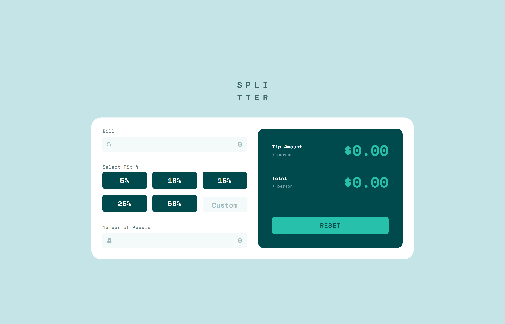

# Frontend Mentor - Tip calculator app solution

This is a solution to the [Tip calculator app challenge on Frontend Mentor](https://www.frontendmentor.io/challenges/tip-calculator-app-ugJNGbJUX). Frontend Mentor challenges help you improve your coding skills by building realistic projects.

## Table of contents

- [Overview](#overview)
  - [The challenge](#the-challenge)
  - [Screenshot](#screenshot)
  - [Links](#links)
- [My process](#my-process)
  - [Built with](#built-with)
  - [What I learned](#what-i-learned)
  - [Continued development](#continued-development)
  - [Useful resources](#useful-resources)
- [Author](#author)

## Overview

### The challenge

Users should be able to:

- View the optimal layout for the app depending on their device's screen size
- See hover states for all interactive elements on the page
- Calculate the correct tip and total cost of the bill per person

### Screenshot



### Links

- Solution URL: [Add solution URL here](https://your-solution-url.com)
- Live Site URL: [Add live site URL here](https://your-live-site-url.com)

## My process

### Built with

- Semantic HTML5 markup
- Flexbox
- CSS Grid
- Mobile-first workflow
- [React](https://reactjs.org/) - JS library
- [TailwindCSS](https://tailwindcss.com) - CSS Framework
- [Vitest](https://vitest.dev) - Testing Framework

### What I learned

Import `defineConfig` from `vitest/config`, there is no `test` key in `vite`.

```js
// vite.config.ts
- import { defineConfig } from 'vite';
+ import { defineConfig } from 'vitest/config';
...
export default defineConfig({
  ...,
  test: {
    globals: true,
    environment: 'jsdom',
    setupFiles: 'path to setup test file',
  },
});
```

*If encountering error for react vite plugin not compatible for the plugins key in config, remove and add the vite and vitest package.*

### Continued development

I want to focus on building projects with TDD approach, as I am not comfortable with writing tests as of now, can't wrap my head around writing tests and what should I test in an application.

### Useful resources

- [Testing Front-end](https://www.frontendmentor.io/learning-paths/introduction-to-front-end-testing-kacF_IJQO5) - This learning path is helping me learn testing for front-ends.

## Author

- Website - [Saakar Gogia](https://saakar.framer.website)
- Frontend Mentor - [@saakarx](https://www.frontendmentor.io/profile/saakarx)
- Twitter - [@cea_horse](https://www.twitter.com/cea_horse)
